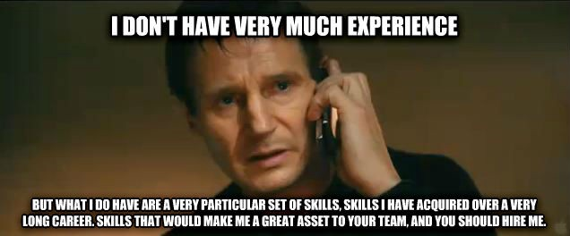

One of my new friends in tech recently shared her experience at a recruiting event; she is a Bootcamp graduate and was attending a hiring event at a company here in San Francisco. In not so many words one of the recruiters at the event told her she could only “dream of working at this company”. Her skills were not up to par for even a Junior position or internship there; she should try to keep studying and maybe in a couple of years she could be worthy. This vomit of observations based solely on assumptions, he had not looked at her resume or portfolio. He had one piece of information, her educational background that was all.

It turns out this type of perception is still very much alive and rearing its ugly head in silicon valley. Someone at that company did not get the memo; **Tech companies are changing.** And the change is not going to stop.

How great x, y or z you are, it is entirely unrelated to the way you obtained those skills. For those of you who been in the service remember hearing about “[field commissions or battlefield promotions](https://en.wikipedia.org/wiki/Battlefield_promotion)” sure they are not as common now, during war they were a tool to recognize leadership, performance and promote soldiers regardless of their pedigree. It was in the thick of things you got to prove yourself, and no one questioned your background.

Stories like my friend’s infuriate me and bring on my own self-doubts. I am new here, I have over 15 years of experience in leadership, project management, running a business, creating and promoting growth, but in this space I am new.

I have been fortunate to have a brilliant mentor, and she made an excellent point to me when I needed it the most, she gave me what’s been the best piece of advice I’ve heard in a long time. She said “don’t confuse access with skills” her point was just because others might have access to knowledge and training a long time ago doesn’t mean they would be better than someone who is only getting it now.

You should no longer assume talent is related to a prestigious education and in some cases related experience, people are entering software development from all [walks of life](http://www.npr.org/sections/alltechconsidered/2016/05/06/477033781/from-coal-to-code-a-new-path-for-laid-off-miners-in-kentucky). Industry leaders such as GitHub have no [education requirement](https://twitter.com/agelender/status/776468076506128384) for any job. Whether you are self-taught, have an Ivy League degree or are a boot camp graduate, you have a place in this space.

I urge not to be discouraged, instead, be determined. I know my friend will prove that recruiter wrong when she finds the right opportunity to excel. Let’s us all remember “You never know who is going to be your boss one day” keep an open mind and give people the opportunity to prove themselves. You might just be pleasantly surprised!
