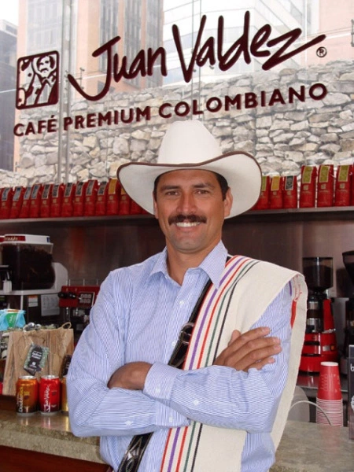

I have been working since I was 15 years old. Having graduated high school in Colombia a couple of years early, I had two choices proposed by my step-father at the time, either 1)learn to sew or 2)start working.

I’d been accepted into our local University so these two propositions were definitely not what I had in mind. I’m not crafty by nature so a career in sewing was a very unlikely choice.

So using my step-father’s social security ID, I became an Admin assistant at the same high school which I graduated from, back in the 90’s. The Colombian labor system was not too concerned with a little girl using a fake id to work.

Working at this school taught me a lot, less about admin duties and more about politics and the challenges in how public schools compete for funding (in what was then a very corrupt political ambient). More importantly it taught me the importance of doing something you love, I loved that job. I felt I added value to my team, even though I was very young and not expected to do more than file papers and print transcripts, my opinions were heard and considered. That was priceless and I should emphasize the importance of being priceless, since my step-dad cashed my hard earned checks (they were in his name after all) and kept the money to himself.

A series of unfortunate (but really fortunate at the end) events caused my immigration to the U.S.. I was 17 years old and spoke your basic “guer es de baroom?” english and came to America to start a new life and join my mom who had emigrated to New York 6 years before. Thanks to LaGuardia Community College and in particular to my ESL teacher Ellen, I was inspired by the proposition that in America you could really be and do anything you set your mind to. Naturally, when a sharply uniformed wearing recruiter was sitting outside my school explaining how the Army could help me “be all you can be” I was sold, I had to join. This country had saved my moms life and was now mine and my brother’s home, I had to give back. I wanted to ‘be’ and ‘give’ more. Much to the absolute terror of my mom who thought she just got her daughter back, I was off to be all I that I could be, it nearly killed her to sign the permission slip (underage people need this to join) but she let me go.

---

Looking to do your part? One way to get involved is to read [**_the Indivisible Guide_**](http://bit.ly/2kwhGTX), which is written by former congressional staffers and is loaded with best practices for making Congress listen. Or follow this publication, connect with us on [**_Twitter_**](http://bit.ly/2kaQ8T7)_,_ and [**_join us on Facebook_**](http://bit.ly/2l89jAW).

