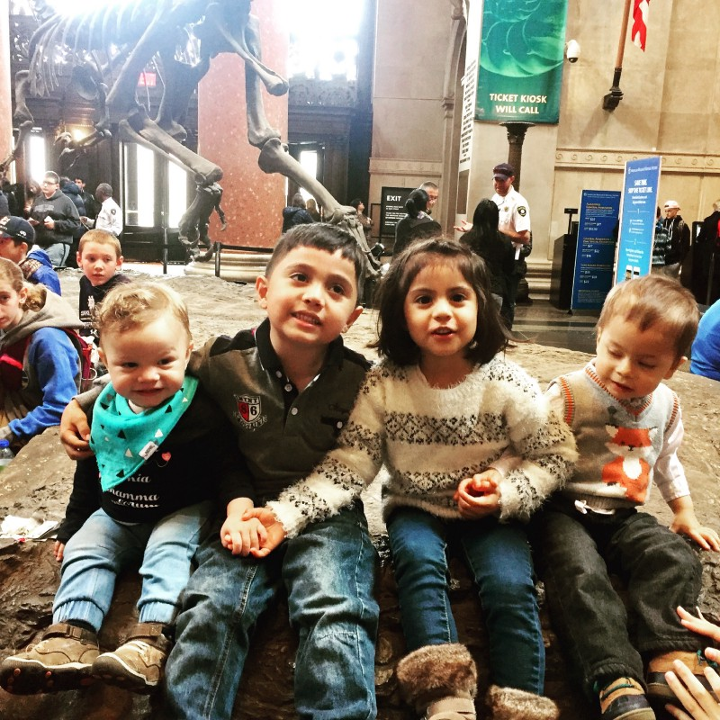

Here is a story I’ve never publicly shared. I don’t like to talk about it. It’s a sad story; we live in such challenging times to be honest I’d much rather write about fun tech stuff or my beautiful boys. So why share it? Because sometimes you need to put a face to your cause, it is easy to be a keyboard hero to make statements about issues you know nothing about and don’t affect you at all, I want people to read and open their hearts at least for two minutes. The new immigration enforcement policies are changing lives impacting families forever. Immigration has impacted my life always.

In 1991 my mother Gladys was given six months to live, she was battling both breast and uterine cancer and was losing the fight. The radiation unit in the hospital she was being treated was out of service, and the only other unit available in the city was being prioritized for children. Her doctor told her there were some new experimental treatments in Houston, Texas so she should try to get there no guarantees, it was her last shot.

Being a law bidding citizen, she applied for a visa and was denied. Gladys is a warrior and dying at 34 with two young children at home was not an option. So she sold everything she owned, borrowed money and hired a “coyote.” I was 11 years old and my brother 7 when we said goodbye. I thought I would never see her again.

She went from Cali to Mexico where she lived at her coyote’s house until the time was right to cross the border. She was scared, sick and missed her children.   
The details of her crossing are a secret; I think it painful for her to talk about, the only thing she has ever mentioned is that for the time being she was given a new name “Guadalupe.”  
When she arrived in Houston, she had nothing but the clothes she was wearing and a picture of us.

**This country saved my mother’s life** she was able to go to a hospital and receive the treatment she needed. Once in remission, she traveled to NY to join childhood friends who had also illegally entered the country as teenagers but thanks to a lot of hard work and President Reagan’s amnesty they were now legal residents.  
She could have come home, but then my then step-father had moved on and started a new family. Having used her life savings to get to the U.S. Gladys knew that to give us kids a better life, she had to stay and work.  
She cleaned toilets, worked at a laundromat, babysat, worked at a hat factory, was overworked and underpaid.

One of her childhood friends in N.Y. fell in love with her and proposed they got married to request residency for herself and later us kids. So she did. We waited six years for our paperwork to process. When it finally did my brother, and I entered the U.S. as legal residents. The privilege of our entry granted by a boy responsible for feeding his entire family, a dying woman who refused to give up and a Republican President. An ICE raid would have deported my Dad (a title he has earned) his family would’ve never lifted from extreme poverty and my mother well, she would be dead.

Unless you have lived this life, you will never understand the struggles of immigrants legal or not. So before you put your make America great hat on, remember we are all descendants of immigrants, and this is the very reason why America is already great. I am now a U.S citizen and have served in the U.S. Army; my brother is an Electrical Engineer working for the finest subway system in the world. We both pay our taxes as do our parents.

---

\*Know your rights [what to do if ICE comes to your door.](https://unitedwedream.org/blog/ice-comes-door/)
