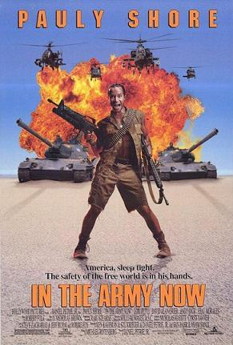

My experience In the Army shaped me, I would not be the person I am today had I not set foot in that Fort Hamilton MEPS, what feels like a million years ago.

I was once again reminded of the power of will, and doing something because you truly love it. I won’t go into the details on how hard things were with my language barrier (I have a funny story about only eating grits and eggs for the first week in basic training because that is all I knew how to ask for…), how some tasks made zero sense, like literally none, but for whatever reason we did them anyway. I loved being a soldier. I was part of something big, bigger than me, an organization that had an impact far beyond me, that was amazing.

I grew up in the Army, I learned teamwork, I learn to be humble, to listen, to look at the bigger picture, to care. When I became a leader I learned to lead by example and to never ask anything of someone I would not be willing to do myself, to look for my soldiers well being before my own; and more gratefully I learned English and managed to graduate Cum Laude from University.

I think the reality of many veterans once the decision is made to leave the service is terrifying… what next, and oh crap now I have no housing, no insurance, no money, no structure, no family. Life after the Army was not without it’s challenges.

I was able to retain my eagerness to serve my country as a contractor and later a civil servant still supporting soldiers. I was a part of that something amazing I loved. Life happens and I was presented with the opportunity to start a business, one that grew and was financially rewarding.

My choices for life partner and business partner at the time were not wise so after many years of hard work I walked away zero’d out to start a new life and yet another new career. After a very interesting and educational time supporting customers at Amazon.com, I took a job at a local construction company, working primarily with Fannie Mae, working on making bank owned properties ready to be sold again. I was making things, managing crews, budgets, it was a job that really took two people but I did it on my own with pride.
