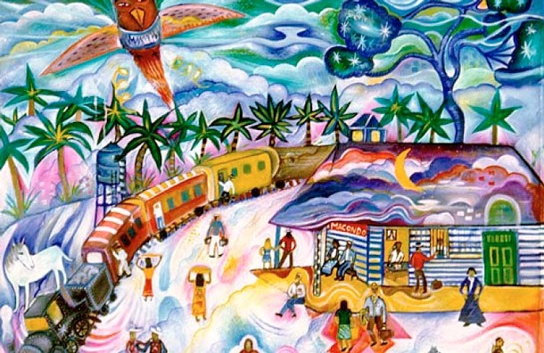
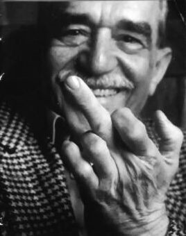
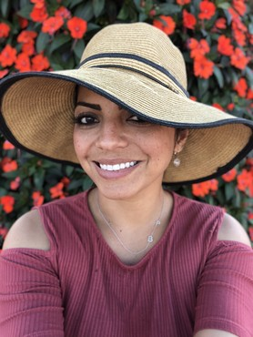

> “What matters in life is not what happens to you, but what you remember and how you remember it”. — Gabriel García Márquez

Today is the anniversary of what would have been Gabriel Garcia Marquez 91 st birthday. Growing up in Colombia, Marquez’ novels were not only required reading for school but a source of pride, representation, and identity. To me, His books describe a world of fantasy, mysticism, passionate love and loss. They are timeless.

I remember the first time I read “One Hundred Years Of Solitude” I’ve imagined Macondo as real as my room, and cried ugly tears for the real-life Banana massacre victims. I was both amazed and terrified by his words. In retrospect, it was perhaps too mature reading for a 10-year-old. Nonetheless, his writings remain with me, engrained in my soul and a part of my life forever.

Last year I was forced to face my mortality. Naturally, I went through all the stages of grief, grieving perhaps the innocence of a life without a set expiration date. The more I read about the statistical outcome for different treatments in reference to life expectation the more my reality appeared gleam. Bargaining for more time I was forced to put my faith in a game of numbers. Enduring treatments that could very well bring more ailments in the future but will in the best possible outcome allow me to have a future. I thought a lot about my childhood during this time, about a life lived in a giant hurry, about the books that meant so much to me and all the time I’ve missed enjoying them by letting the world prioritize my choices.

The mind is powerful, have you ever smelled something and it reminded you of a very specific point in your life? Or maybe seen a color that brings back an image of something you saw years ago. I’m fascinated by the way our brain catalogs memories and how it decides what moments to show you and when. During what was a tough time in my life, my brain chose to bring back the memories of a little girl reading and dreaming, imagining a life beyond her room. That is what I’ve remembered…not the sadness or fear I felt during my childhood. My brain picked the good parts of this chapter in my life and omitted the ugly. Maybe this was an unconscious- yet conscious choice.

Gabo said it best _“ is not what happens to you, but what you remember and how you remember it.”_ From the past year, I’ll choose to remember the love I felt from friends old and new, the generosity of my colleagues, the compassion of my husband and the happiness in my children’s eyes when I got home from the hospital. I’ve learned a lot, my battle is not over, but for right this moment the battlefield is calm. My hair is growing, and my energy is coming back, I’m reading again, lighting a fire in me to write and to share. If I can share one lesson with you today it’ll be more a request to take to a second to find that pleasant smell and the beautiful colors, to engrave them in your heart, and ask your brain to remember the good parts. We are all dying after all…just not yet and hopefully for me not for at least another 63 years.

