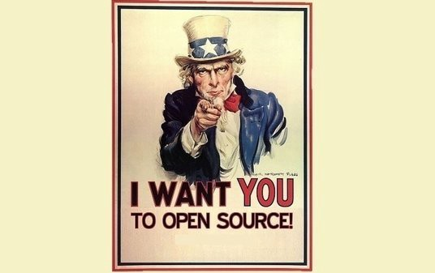

> Have you ever been curious about contributing to an open source project?wondering why spend your valuable time on **unpaid** projects?

Consider this: Today, it’s **not possible** to create software without using open-source components. [Developers use open-source components as their foundation](https://www.blackducksoftware.com/forrester-software-composition-analysis-q1-2017), creating applications using only 10 percent to 20 percent new code. Open Source is the future of technology, and you can help shape that future.

Working on open source projects can be incredibly rewarding. You will be helping your favorite cause solve problems, or maybe working on a new project within your company different from your responsibilities. Doing this while building your public code base of contributions one that can show your colleagues and potential employers your ability to work collaboratively and your eagerness to learn.

There are many ways to contribute [not only code](https://opensource.guide/how-to-contribute/#you-dont-have-to-contribute-code). **Contributions are valuable regardless of their level of complexity**, taking the time to improve a project, no matter how big or small your contribution it is likely to be appreciated!

**Selecting a project**

Choose a project by first figuring out what you are passionate about, this will help keep you engaged. Make a list of things you’re interested in, start by choosing two and focus your search there.

If you have a project that you already use and are passionate about. Start there…but remember you don’t have to make a permanent commitment.

When considering a project ask your self:

Am I comfortable in this project’s community? Is this something that feels more like work and less a hobby? Am I interested in learning a new skill in order to contribute? Is there a local meet-up I could attend to learn more about the project?.

Having community support can make your first contribution a great experience. If the project has a “slack” channel or “discuss” board participate in them, with some luck you can even find a willing “first pull request mentor”. Open source is only partly about code. Community makes open source work. Be a part of the community.

I hope you are intrigued enough to start contributing. You have nothing to lose and everything to gain. Happy committing!

---

_Check our_ [_your first pull request_](https://yourfirstpr.github.io/) _a site dedicated to help you get started contributing to open source._

> _If you like this post, don’t forget to recommend and share it._

[**Will You Help Us Grow Our Community?**  
_Help us #AmpCodeLikeAGirl_code.likeagirl.io](https://code.likeagirl.io/will-you-help-us-grow-our-community-c0247590255e "https://code.likeagirl.io/will-you-help-us-grow-our-community-c0247590255e")
