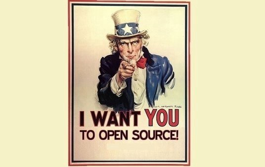

> ¿Alguna vez has sentido curiosidad por contribuir a un proyecto de código libre (open source)?, ¿te preguntas por qué gastar tu valioso tiempo en proyectos no pagados?

Ten en cuenta lo siguiente: Hoy en día, no es posible crear software sin utilizar componentes de código libre. [Los programadores usan componentes de código libre como su base](https://www.blackducksoftware.com/forrester-software-composition-analysis-q1-2017), creando aplicaciones con sólo de 10% a 20% de código nuevo. “Open Source” es el futuro de la tecnología, y tu puedes ayudar a moldear ese futuro.

Trabajar en proyectos de código libre puede ser increíblemente gratificante. Estarás ayudando a tu causa favorita resolver problemas, o tal vez trabajando en un nuevo proyecto dentro de tu empresa diferente de tus responsabilidades diarias. Haciendo esto, mientras construyendo tu base de código y contribuciones una base que le muestra a tus colegas y posibles futuros empleadores tu capacidad de colaboración y tu interes en aprender.

Hay muchas maneras de contribuir no sólo [escribiendo código](https://opensource.guide/how-to-contribute/#you-dont-have-to-contribute-code). **Las contribuciones son valiosas independientemente del nivel de complejidad**, tomando el tiempo para mejorar un proyecto, no importa cuán grande o pequeña tu contribución sera apreciada!

**Selección de un proyecto**

Para elegir un proyecto primero es bueno preguntarse que te apasiona?, esto te ayudará a mantener tu interes. Haz una lista de cosas que te interesan, comienza por elegir dos y enfoca tu búsqueda allí.

Si tienes un proyecto que ya usas y te apasiona. Comienza ahí … pero recuerda que no tienes que hacer un compromiso permanente.

Al considerar un proyecto pregúntate:

¿Me siento cómodo en la comunidad de este proyecto? ¿Es esto algo que se siente más como trabajo y menos como un pasatiempo? ¿Estoy interesado en adquirir una nueva habilidad para contribuir? ¿Hay un encuentro local al que podría asistir para aprender más sobre el proyecto ?.

Tener apoyo de la comunidad ayudara a que tu primera contribución sea una gran experiencia. Si el proyecto tiene un canal de “slack” o “discuss” participa en ellos, con algo de suerte puedes encontrar un “mentor para tu primera pull request o contribución”. Open source es sólo parcialmente basado en código. La comunidad es la que logra que el código libre funcione. Se parte de esa comunidad.

Espero que estés lo suficientemente intrigado para empezar a contribuir. No tienes nada que perder y todo que ganar. Feliz contribuciones!

---

Consulta your [first pull request](https://yourfirstpr.github.io/) y como [contribuir sin escribir codigo](https://hipertextual.com/archivo/2014/06/contribuir-con-proyectos-open-source/) sitios dedicados a ayudarte a empezar a contribuir con código abierto.
