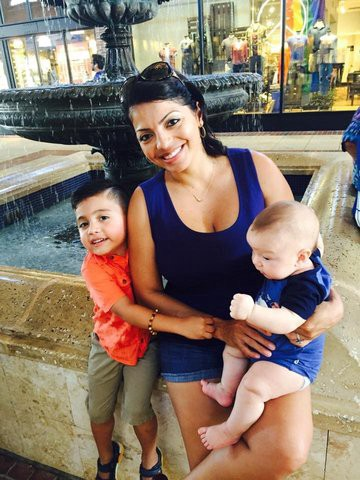

The birth of a child is by far the most powerful thing I have ever experienced. In a blink your life and priorities change. Nothing is more powerful. The transition from one to two kids while working a full time job, is the hardest thing I’ve ever done.

I was exhausted and up all night with pressing questions i.e.: is my firstborn going to hate me now? is baby’s fast breathing normal? Is memory loss a side effect of breastfeeding? Laser or clip for lip tie? Will baby remember pain? Will my nipple grow back? And all time favorite, if I throw a dirty diaper at my snoring husband will he wake up? Will he divorce me?

Looking for resources, I became more involved with online communities, I was part of a couple of support groups for new parents, working parents, baby-wearing and breastfeeding. My online friends became my lifeline.

I even started my own community “breast feed chic” I did it mostly out of necessity I was back at work and none of my clothes fit, much less worked for breastfeeding and pumping. So I researched nursing friendly brands and shared pictures and recommendations.

Learning and enjoying the camaraderie of online communities and having been always technically curious. I decided to teach my self a thing or two, in my mind I would fly through free code camp (a popular web development course) and build my own site in maybe two weeks tops. I mean it all looked so easy.

Boy was I wrong, web development is hard, developing with no guidance or mentorship is almost impossible. So I began to look for online communities that could mentor me.

To my incredible surprise there was an organization called “Operation Code” a non-profit dedicated to helping veterans learn how to code and enter jobs in the Tech industry. The first time I talked to [David Molina](https://medium.com/u/68cb20508813), the founder, I was blown away by the mission of [Operation Code](https://medium.com/u/9219f2625b9e), joining their slack room I found support and encouragement. I had a new community, welcoming and willing to help me learn. Again my online friends were my lifeline. Technology made my life better, it was then I decided I would do whatever it took to find my place in Tech.

_Views expressed are my own, thank you_ [_David Molina_](https://medium.com/u/68cb20508813) _the work you and_ [_Operation Code_](https://medium.com/u/9219f2625b9e) _do for veterans makes a difference._
