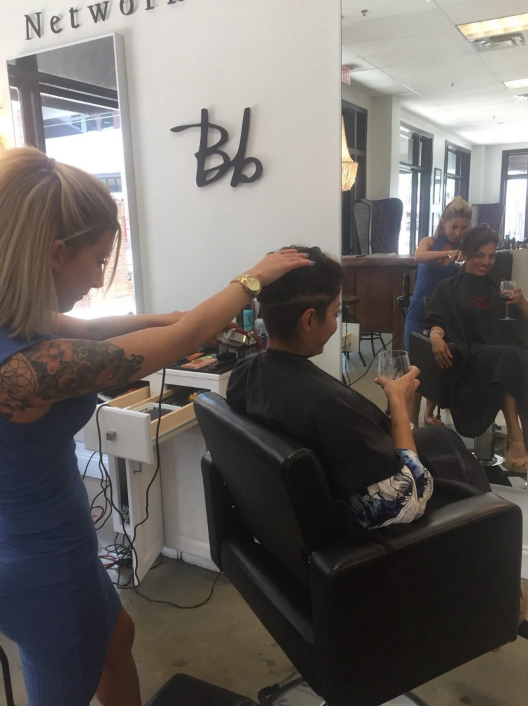
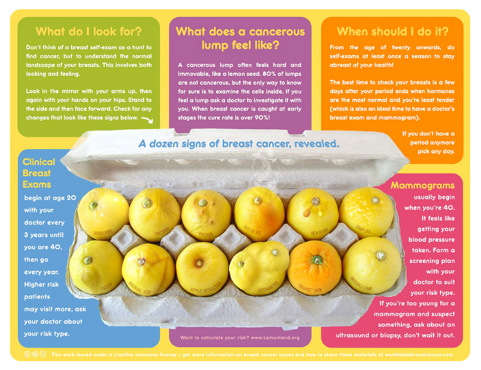

There has been a lot of change in my life over the past five months. I’ve had the opportunity of a lifetime to kickstart my career transition into tech by joining GitHub as an apprentice. I have been facing my fears head on and putting my best energy out into the world. Things were good.

Five months ago my first cousin was diagnosed with thyroid cancer. We have always been close, I was sad for this news especially because she desperately wants to be a mother, and this diagnosis throws a huge wrench in that plan, having struggled with fertility issues myself I understand that overwhelming feeling of wanting something so bad it hurts. It’s heartbreaking. Her diagnosis prompted my mom to have her own thyroid investigated as she felt something was off for months. Fast forward many biopsies later she once again has cancer this time in her thyroid and again in her breast. Her prognosis is not clear. I can’t believe she has to deal with this yet again.

Last year I had genetic testing due to my mom’s early age at diagnosis, my results showed “a marker of unknown significance” on the STK11 gene, going into testing I had my mind made up: if the results were positive I would take action. I was prepared to do whatever necessary to make sure I stay healthy for my family. Then I found a lump. Cancer is a cruel joke. I promise you my body is alkaline, I don’t consume immense amounts of sugars, I use toxin free products. I am a vegetarian, health conscious and active.

Lots of testing an MRI, mammogram, ultrasound, biopsy & PET scan later is confirmed: I have breast cancer. Just writing that is surreal. The C word is once again influencing my life; when I was a kid it devastated my childhood as it took my mom away from six years. And now threatens to do the same, well fuck that…I will not let this awful disease do the same to my kids.  
So we are fighting! I’ve had a round of chemo, first of eight. Later this year I will undergo a double mastectomy and radiation. **This cancer will not kill me.** I have much to live for and so many people rooting for me.   
  
Jokingly I told my husband “we are on the up and up from here,” we had the worst possible news so from now on moving forward everything will be good, it has to be. When faced with devastating news you quickly figure out who matters in your life, I’ve heard from old friends and even made new ones. My husband’s company has been incredibly understanding, and he is working from home to support me. My [old boss](https://twitter.com/leedohm) from GitHub (one of the kindest humans I’ve ever met) started a go fund me campaign to help, I will forever be grateful to my GitHub family for keeping me in their hearts, their generosity beyond touched me, so many people honestly give a shit what happens to me. So I will fight, I will beat this, and I will use my voice to raise awareness for research and support.

Now comes the ask, I need you to do me a favor, look down your shirt, do you see your boobs? Take a look at the chart below and examine them and if anything feels off ask your Dr.

The C word is scary AF but never forget the power of intention is far greater than that of fear. And we all fully intent to stay alive around here.

